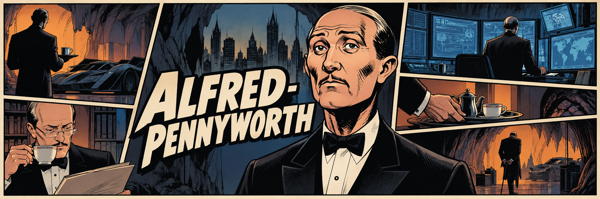

<p align="center">
  
</p>

# ALFRED PENNYWORTH

> **Issue #0 — The foundation.**
>
> A founder operating intelligence for the work that falls between systems: understand the company, investigate what changed, propose the next move, act only within authority, verify the outcome, and remember the useful parts.

This is not a dashboard in a trench coat, and it is not a chatbot with an expensive vocabulary. Alfred is being built as the operating layer between a founder and the noisy, incomplete reality of a company.

## The case file

The engineering constitution lives in [alfred-pennyworth.md](./alfred-pennyworth.md). It is the source of truth for architectural decisions.

The first working loop is deliberately modest:

```text
REQUEST → CONTEXT → PLAN → POLICY → APPROVAL? → EXECUTE → VERIFY → REPORT
```

The graph is real. The authority boundary is real. The integrations are not yet real, so Alfred says so. An approved email request without an email adapter fails explicitly: no “sent” claim, no imaginary activity feed.

## What is in this issue

| Component | Status | Why it exists |
| --- | --- | --- |
| Typed domain model | Present | Company concepts stay independent of frameworks and providers. |
| LangGraph supervisor | Present | Makes task lifecycle and approval interruptions inspectable. |
| Policy engine | Present | The model never decides its own authority. |
| Zod boundaries | Present | Requests, configuration, and tools fail early and clearly. |
| Tool contracts | Present | Every capability has schemas, risk, authority, execution, and optional verification. |
| PostgreSQL migrations | Present | Structured company state has a real future system of record. |
| LangSmith wiring | Present | Explicit opt-in tracing; no key, no pretend observability. |
| Real integrations | Not yet | No Gmail, CRM, GitHub, or finance claims until adapters are verified. |

## The Batcave, minus the cosplay

```text
apps/
  api/          HTTP boundary, LangGraph runtime, policy, tools, memory ports
  web/          Thin typed command surface — not a SaaS dashboard
packages/
  domain/       Framework-free company language
  schemas/      Zod request contracts
  config/       Validated environment configuration
  database/     Explicit PostgreSQL migrations and runner
tests/
  unit/         Policy, memory, configuration, tool validation
  agent/        Graph execution, interruption, resume, honest failure
docs/
  architecture/ Repository assessment
  decisions/    Architectural decision records
```

Dependency direction is intentionally boring:

```text
domain  ←  runtime / policy / tools  ←  HTTP + web
```

The domain does not know LangChain, LangGraph, React, PostgreSQL, or providers exist. That is not ceremony; it keeps a customer, commitment, action, or approval meaningful after the model stack changes.

## Get the lights on

Requires Node.js 22+ and PostgreSQL for migrations.

```bash
npm install
cp .env.example .env
npm run typecheck
npm run lint
npm test
npm run build
```

To apply the initial schema to a configured PostgreSQL database:

```bash
npm run db:migrate
```

To start the API:

```bash
npm run dev
```

`LANGSMITH_TRACING=false` is valid for local development. If tracing is enabled, `LANGSMITH_API_KEY` is required. No credentials belong in source, prompts, or this README.

## Current proof, not marketing

The test suite verifies that:

- low-risk work travels through the graph and is verified;
- consequential work pauses through a LangGraph interrupt;
- approval resumes the task, but an unavailable integration is reported as unexecuted;
- policy can allow, require approval, or deny;
- invalid tool input is rejected before execution;
- memory is scoped and retrievable;
- invalid configuration is rejected.

```bash
npm test
```

## Reading order

1. [The project bible](./alfred-pennyworth.md)
2. [Initial repository assessment](./docs/architecture/foundation-assessment.md)
3. [Runtime and approval decision](./docs/decisions/ADR-002-langgraph-policy-and-approval.md)
4. [PostgreSQL decision](./docs/decisions/ADR-003-postgres-as-system-of-record.md)

## Next issue

Build one honest vertical slice:

> **“Why is this month’s revenue behind target, and what should I do?”**

That means real read-only revenue, pipeline, and customer adapters; source-backed evidence; PostgreSQL-backed state; and an evaluation case. It does **not** mean adding a dozen agent personas or a glossy dashboard.

---

**Prime directive:** protect the founder’s attention, increase the company’s ability to act, and never confuse initiative with authority.
